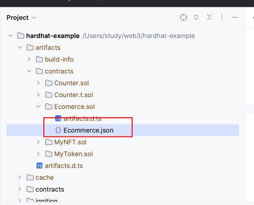

# 合约上架商品功能
主要的合约代码
Ecomerce.sol中
编写完代码执行
编译命令
npx hardhat compile
编译完成后在目录中会有artifacts/contracts/  目录，
找到对应的合约目录；然后找到对应的合约json文件；文件中有abi
abi用于后端的配置

将合约部署到hardhat 本地的网络中
npx hardhat node
可以获取到合约的地址和key
部署本地网络的key用于后端的配置

编写测试合约
scripts/deploy.ts
发布测试商品信息
执行编译
npx hardhat run scripts/deploy.ts --network localhost
会有一个合约地址
用户后端的配置文件
